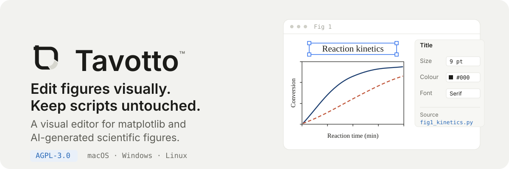
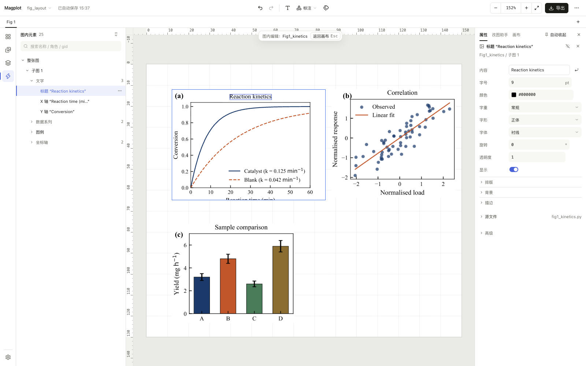

<p align="center">
  
</p>

<p align="center">
  <a href="https://github.com/erwanjun/magplot/releases"></a>
  <a href="https://github.com/erwanjun/magplot/actions/workflows/ci.yml"></a>
  <a href="./docs/LICENSING.md"></a>
  
  
</p>

投稿前的最后一公里通常是这样的：图早就画好了，但要拼成 Figure 1、调字号、
挪图例、对齐版面——于是回到 Python 里改一行、重跑脚本、再看一眼，来回二十遍。
或者把 PDF 拖进 Illustrator，从此和脚本失去联系。

**Magplot 让你直接在图上改。** matplotlib 输出的面板拖进画布自由排版，
双击任意一张图就能点中里面的标题、坐标轴、曲线、图例——改字号、换颜色、拖位置，
Python 在后台实时重渲染（热态约 40 ms）。所有修改都是**非破坏 override**：
你的脚本一个字节都不会被改动，随时可撤销。导出时引擎按全质量重新出图，
合成一份文字可选中的真矢量 PDF。

<p align="center">
  
</p>

<p align="center"><sub>左：图内元素树 · 中：排好的 150×130 mm 版面 · 右：选中标题后可改的属性（源文件仍是 <code>fig1_kinetics.py</code>）</sub></p>

## 安装

三个平台命令相同。推荐 [pipx](https://pipx.pypa.io/)——它把 Magplot 装进独立环境，不会污染你的科研环境：

```sh
pipx install "magplot[worker] @ https://github.com/erwanjun/magplot/releases/latest/download/magplot-0.1.0-py3-none-any.whl"
magplot
```

浏览器会自动打开 `http://127.0.0.1:5089`。

<details>
<summary>用 pip 装 / 已经有科学栈环境 / 从源码跑</summary>

**pip**（装进当前环境）：

```sh
pip install "magplot[worker] @ https://github.com/erwanjun/magplot/releases/latest/download/magplot-0.1.0-py3-none-any.whl"
magplot
```

**已有装了 matplotlib 的环境**：去掉 `[worker]` 只装本体，再用环境变量指定渲染解释器——
这样 Magplot 用的就是你论文脚本所在的那套依赖，图长什么样完全一致：

```sh
pipx install "magplot @ https://github.com/erwanjun/magplot/releases/latest/download/magplot-0.1.0-py3-none-any.whl"
export MM_WORKER_PYTHON=/path/to/your/env/bin/python   # Windows: setx MM_WORKER_PYTHON "..."
magplot
```

**从源码跑**（需要 node + pnpm 构建前端）：

```sh
git clone https://github.com/erwanjun/magplot.git && cd magplot
python -m venv .venv && .venv/bin/pip install -e ".[worker,dev]"
python scripts/build_frontend.py
.venv/bin/magplot
```

</details>

**命令行参数**：`magplot --figures <目录>` 直接打开某个图库；`--port 5089` 换端口；
`--no-browser` 不自动开浏览器。

### 先跑通一遍

仓库里带了一个可直接打开的示例项目：

```sh
magplot --figures examples/figures
```

三张面板会出现在左侧素材栏。拖到画布上，双击其中一张——你会看到图内元素树，
点标题就能改字号。`examples/figures/` 里就是两个普通的 matplotlib 脚本，
Magplot 不要求你按任何特殊方式写它们。

## 怎么做到的

Magplot 跑一次你的脚本，在 `savefig` 处把 Figure **截在内存里**（不写任何文件），
之后所有编辑都是直接 mutate 内存里的 artist，再导出带 gid 的 SVG 给前端。

```text
你的 fig.py ──跑一次──▶ Figure 常驻 worker 内存 ──▶ 带 gid 的 SVG（画布上可点选）
                              ▲                              │
                              └──── override 全量列表 ◀───────┘
                                    （脚本不被改动，⌘Z 可撤销）
```

override 是**全量列表**语义：前端每次发完整清单，worker 对照 originals 表把
缺失的键恢复原值——这就是撤销的基础，也保证了「改了又改」不会累积漂移。

冷启动要跑一次脚本（轻量图秒级，重数据图分钟级），之后每次修改都是亚秒级。
脚本被外部改动（你手改，或让改图助手改）后会话自动作废，下次重建。

## 能改什么

| | |
|---|---|
| **文字类** | 标题、坐标轴标签、刻度标签、图例、图内注释——内容 / 字号 / 颜色 / 字重 / 字形 / 旋转 / 透明度 / 显隐，可直接拖动 |
| **数据系列** | 线宽、线型、颜色、marker（散点可整体换形状）、图例条目顺序 |
| **坐标轴** | 刻度组、轴线、网格、3D 视角（elev/azim/roll）、3D 轴箭头与背景面板 |
| **图幅** | 整张图的尺寸（会重排版）、背景 |
| **不开放** | 盒内数据属性（xlim/ylim/scale/spines）与色条方向——这些改动要重建坐标轴，会打乱 gid 稳定编号 |

画布层另有一整套排版能力：智能吸附对齐、多选分布、成组、布局组（行/列/网格约束，
尺寸变化自动重排）、任意角度旋转的文字/箭头/形状标注、科研预设（可逆反应箭头、
比例尺、误差标注、放大框）、多画布标签页、布局版本时间线、论文样式批量应用。

## 导出

PDF 走 `show_pdf_page` 把原始矢量面板整块嵌进去，**文字仍可选中、可搜索**；
PNG 由同一份 PDF 按 DPI 渲染，两者绝不会不一致。导出前自动预检越界、重叠、
低字号、低 DPI、过期渲染与缺失素材，可随成图写一份 proof report 作为投稿留档。

有两处明示的保真取舍：面板设了 `opacity < 1` 或翻转时，该面板按导出 DPI 转成位图嵌入
（PDF 矢量 xobject 没有整体 alpha，`show_pdf_page` 也不支持镜像）。

## 改图助手（可选）

右栏「改图助手」可以把需求交给你本机的 **Codex / Claude CLI** 去直接改脚本
（例如「把图例移到左上角并缩小到 7pt」）。改动前自动快照，完成后显示 diff 并重渲染，
不满意可一键回滚。没装这些 CLI 不影响其余功能。

## 你的数据在哪

全部在本机。渲染、合成、导出都是本地进程，图和数据不上传任何地方。

| | |
|---|---|
| 文档与布局 | `~/Library/Application Support/Magplot/`（Linux `~/.local/share/magplot/`，Windows `%LOCALAPPDATA%\Magplot\`） |
| 你的脚本与图 | 只读——除非你明确点「写回原始文件」（可在项目设置里锁死） |
| 唯一的对外请求 | 每天一次向 GitHub 查有没有新版本，可在「设置 → 检查更新」关掉 |

## 已知边界

- **冷启动跟着你的脚本走**。脚本要跑 3 分钟，第一次进编辑态就要等 3 分钟。
- **需要一个装了 matplotlib 的解释器**。`[worker]` extra 会带一个；也可以用
  `MM_WORKER_PYTHON` 指向你自己的环境。
- **坐标轴范围之类的盒内属性不开放**，见上表。要改这些请改脚本（或让改图助手改）。
- **尚未发布到 PyPI**，安装走 Release 上的 wheel URL。

## 开发

```sh
.venv/bin/python -m pytest        # 后端 152 项
cd web && pnpm test               # 前端 38 项
cd web && pnpm tsc --noEmit && pnpm build
```

架构约定见 [CLAUDE.md](./CLAUDE.md)，其中最要紧的两条：
`engine/registry.py`、`pool.py`、`ai_bridge.py` 必须保持**纯标准库**可 import
（Flask 父进程里没有科学栈）；`src/magplot/pdfbackend/` 是**全仓库唯一** import
PyMuPDF 的地方。

## 许可证

[**AGPL-3.0-only**](./LICENSE)。这不是偏好而是依赖决定的——渲染用的 PyMuPDF 是 AGPL。

自己用、改、内部部署都不受影响，**用它排出来的图和导出的 PDF 完全属于你**，
许可证不传染到你的作品。受约束的只有分发：把改过的 Magplot 分发给别人、
或架成别人能通过网络访问的服务时，需要一并提供源码。

PDF 后端已经隔离在单一模块后面，将来换掉 PyMuPDF 后本项目计划转向 MPL-2.0
的 open core 模式。完整说明见 [docs/LICENSING.md](./docs/LICENSING.md)。
