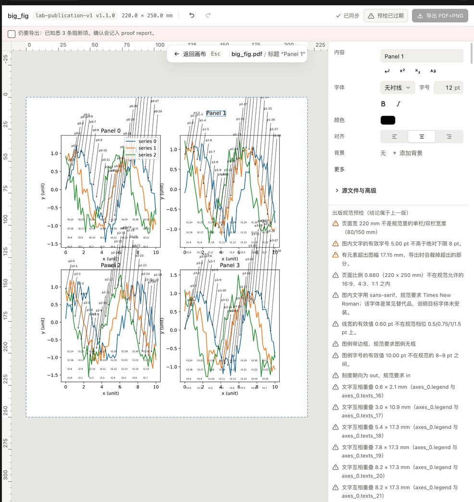
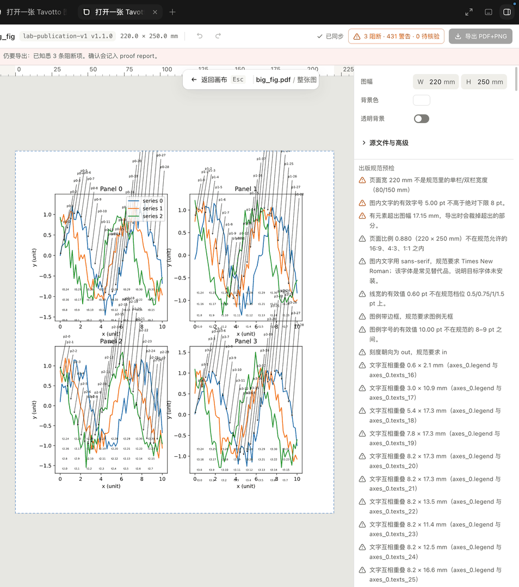

# 真实 Codex Desktop 内嵌画布验收

这份验收只回答一件事：**真实 Codex Desktop 在一次真实 Tavotto 工具调用后，是否把
MCP App 资源渲染成任务内的交互画布。** pytest 的协议测试、浏览器里打开 HTML、
外部 Tavotto 窗口与 `codex exec` 的结构化输出都不能代替它。

## 前置条件

1. 记录待验 commit：`git rev-parse HEAD`，工作树必须没有未说明的改动。
2. 从该 checkout 安装插件，并记录 `codex --version` 与 `codex plugin list --json`。
3. 安装或升级插件后，**新建一个 Codex Desktop 任务**。已打开的任务不会重新加载
   MCP server；在旧任务里看到 `Transport closed` 不是新实现的验收结果。
4. 新任务的工作目录设为这个 checkout。不得预设 `TAVOTTO_MCP_ROOTS` 或任何
   `CODEX_*WORKSPACE*` 兼容变量。

验收使用仓库自带、数值固定的
`tests/acceptance/corpus/c01_lines_scatter_bars.py`，不临时编造图片或 HTML。

## A. capability 与 fail-closed 证据

先让 Codex 只调用 `tavotto_health`。保存完整 structuredContent，并确认：

- `canvas.available == true`；
- `canvas.resource_uri == "ui://tavotto/canvas/v1.html"`；
- `root_authority.client` 记录真实 client/version/protocol；
- `root_authority.client.capabilities.advertised` 来自握手原文；
- 尚未授权时，插件 cwd 不会出现在 `roots`。

第一次调用 open 时传 checkout 下 corpus 的**绝对路径**和 `stem: "c01_line"`。在
确认框先选拒绝/取消：工具必须返回 `workspace_confirmation_declined` 或
`workspace_confirmation_cancelled`，不得建立 session、不得弹浏览器或外部桌面窗口。

## B. 正向 Desktop 证据

再次调用相同 open。确认框必须：

- 显示 corpus 的完整 realpath；
- 默认未批准；
- 说明只在当前 Tavotto MCP 连接内有效。

核对路径后批准。通过需要同时满足：

1. 工具结果成功，含非空 `session_id`、`stem == "c01_line"`，且 `structuredContent`
   里**没有** `canvas_ui`——那个键只在画布挂不上时出现（`available: false` +
   `batch_open` / `widget_missing`），正向结果靠 `_meta.ui.resourceUri` 挂画布；
2. 原始 MCP `tools/list` 描述符的 `_meta.ui.resourceUri` 和
   `_meta["openai/outputTemplate"]` 都等于 `ui://tavotto/canvas/v1.html`；若宿主把
   `CallToolResult._meta` 隐藏在模型工具包装层之外，以协议录制为准，不能据包装层
   缺字段误判 server 没有发送；
3. Codex 任务内实际出现 iframe 画布，能看到标题 **Basic line**、两条曲线与图例；
4. 画布不是浏览器 tab，也不是 Tavotto 外部窗口；
5. 再调 health，`root_authority.source == "user_elicitation"`，根恰好是 corpus
   realpath，`workspace_confirmation.lifetime == "mcp_connection"`。

最后在画布里移动图例或改一个可编辑样式，确认画布收到新的服务端 SVG/manifest；关闭
session。这个交互步骤用来排除“host 只画了一张静态截图”的假绿。

## C. 必须留存的证据

PR 至少附：

| 证据 | 必须包含 |
| --- | --- |
| 环境文本 | commit SHA、Codex 版本、插件安装路径/版本、OS |
| capability JSON | `root_authority.client`、`mcp_roots`、`workspace_confirmation` |
| 负向结果 | 取消后的机器可读 code，且无 session |
| 确认截图 | 完整规范路径与默认未批准状态；可遮住用户名以外的无关信息 |
| 画布截图 | 同一任务里的 Tavotto 工具卡、Basic line 画布与 Codex 外框 |
| 正向工具结果 | session/stem、无 `canvas_ui`，与两项 UI resource metadata |

任何一项缺失都应写成“未验证/被阻塞”，不能把自动化协议绿灯改写成“Desktop 已通过”。

## D. 大图：结果超过宿主 1 MiB 事件上限时画布仍能进 ready（issue #457）

Codex 把每个 MCP 工具结果送给桌面 UI 的副本封顶在 1 MiB，超过就把 `structuredContent`
清空；A/B 用的冒烟图只有 85 KB，量不到这一维。这一节用一张 #457 量级的图
（4 个子图、约 250 段文字、约 120 个箭头注释，元素总数 ≥ 400；同一份脚本可用
`tests/acceptance/corpus/` 之外的任意真实图，只要 `tavotto_open_figure` 的文字里出现
「超过宿主对工具结果的体积上限」那一行）：

1. `tavotto_open_figure`（`project_path + stem`）返回成功，`structuredContent.elided`
   存在、`fields` 含 `manifest`，`session_id` 非空；
2. 同一任务里 iframe 从「正在等待 tavotto_open_figure 的结果」进入画布（能看到标题、
   元素、属性页），Desktop 日志里恰好一次 `mcpServer/tool/call` 的
   `tavotto_session_state`，**没有**第二次 `tavotto_open_figure`；
3. 在画布里拖一个元素，`tavotto_apply_overrides` 照常发全量 patches、画布更新；
4. 再用 `script_path` 入口重开同一张图，1–3 同样成立；
5. 负向对照：用**未修复的插件版本**（≤ 0.15.0）开同一张图，画布永远 waiting——
   证明这张图确实过线，这一节量到的是那一维。

留证：open 的 `structuredContent`（含 `elided`）、Desktop 的 `mcpServer/tool/call`
日志、画布截图、拖动后的 apply 参数。任何一项缺失都写成「未验证」。

## 已知的非交互对照

`codex exec --ephemeral --json` 会真实声明 `elicitation`，但没有真人 UI 时会返回
`action: "cancel"`。Tavotto 必须据此拒绝访问。这条对照证明没有自动批准后门；它不是
Desktop 正向证据。

## 2026-08-24 参考验收记录

- 环境：macOS 26.6.1 (25G76)，Codex Desktop 26.818.41509 (6962)，
  `codex-cli 0.149.1`，Tavotto engine/plugin 0.9.2。
- 真实 client 握手：`codex-mcp-client/0.149.1`，MCP `2025-06-18`；advertised
  capability 只有 `elicitation`，没有 `roots`，因此正向路径由 exact-realpath
  elicitation 授权，生命周期为当前 MCP connection。
- 负向对照：无 UI 的真实 `codex exec --ephemeral --json` 对 elicitation 返回
  cancel；server 返回 `workspace_confirmation_cancelled`，没有建立 session。
- 正向 Desktop：用户在原生确认框批准测试图库 realpath 后，
  `tavotto_open_figure` 返回 `CodexCanvasSmoke`、28 个可编辑元素、
  `152.4 × 96.52 mm` 和非空 SVG；Codex 任务内出现画布、属性页、预检与导出控件。
- 交互：画布内选择/拖动后，Desktop 日志连续记录
  `mcpServer/tool/call`，界面显示“已同步”并把预检标为过期；关闭该临时 session 后
  重新 open，patch hash 回到空列表 canonical hash，尺寸回到脚本原值，证明没有改源码。

这次真实验收同时抓到并修复了两条自动化原先漏掉的错误：

1. MCP Apps `ui/notifications/tool-result` 的 `params` 本身就是标准
   `CallToolResult`；旧 fake host 错包成 `{ result: CallToolResult }`，导致 Codex
   是否能靠兼容全局兜底变成竞态。e2e 现在发送标准直出形状，并保留旧包装兼容。
2. MCP 独立入口漏了桌面版与 playground 都有的 `TooltipProvider`；完整 28 元素
   manifest 一进入属性检查器就会崩。独立 provider 单测保证以后不能再删掉。

## 2026-09-22 D 节验收记录（issue #457，PR #462 合入 main `e3372d94` 之后）

- 环境：macOS 27.0（Darwin 27.0.0），ChatGPT.app 26.915.31945（Codex Desktop 已并入
  ChatGPT，日志仍在 `~/Library/Logs/com.openai.codex/`），`codex-cli 0.155.1`，client
  握手 `codex-mcp-client/0.155.0-alpha.9.2`、MCP `2025-06-18`；待验树 main `6dd63da5`
  （含 #462），画布产物指纹 `777607558226d840`，按 `codex-plugin/AGENTS.md` 的
  「装工作副本」装成 `tavotto@tavotto-dev`；引擎是插件自管 venv 里的 tavotto 0.15.0。
- 图：`big_fig.py`（4 axes、text×244、arrow_patch×116、448 个可编辑元素，220 × 250 mm），
  open 结果未省略时 1,223,557 B——过线。
- 这版 Codex 让模型经 `exec` 脚本里的 `tools.mcp__tavotto__tavotto_open_figure(...)`
  调工具，Desktop 的 item id 是 `exec-…`；画布照样挂在那个 `McpToolCall` item 上，与
  直接调用没有区别。

**D.5 负向对照（先做，插件 `tavotto@tavotto` 0.15.0，未修复版）**：rollout 里 Desktop 收到
的 `McpToolCall.result` 只剩 `content`，`structuredContent` 与 `_meta` **缺失**，
`content[0].text` 是整个结果序列化后截到 **1,048,604 B（1 MiB + 28）** 的预览；
`mcpAppResourceUri = ui://tavotto/canvas/v1.html`、`preferredModelDisplayMode = inline`
——iframe 建了、喂进去的是空壳。画布停在等待的截图这次没留（只有机器证据）。

**D.1–D.4 正向（工作副本，同一任务、同一 server 进程的 stdio 抄录）**：

| # | 调用 | 结果 |
| --- | --- | --- |
| 1 | `tavotto_open_figure(project_path, stem)` | 196,504 B；`elided = {fields: [svg, manifest], inline_bytes: 1223557, budget_bytes: 786432, host_cap_bytes: 1048576, fetch_with: tavotto_session_state, final_bytes: 196504}`；`_meta.ui.resourceUri` 完整；content 含「结果 1195 KiB 超过宿主…已省略 svg、manifest」 |
| 2 | 画布 → `tavotto_session_state(session_id)` | 1,222,508 B，manifest 448 元素、SVG 224 KB、`patches: []`；Desktop 日志恰好一次 `mcpServer/tool/call`（52 ms），**没有**第二次 open |
| 3 | 画布拖动 → `tavotto_apply_overrides` | 全量 patches `[{gid: axes_1.title, prop: pos_frac, value: [0.676, 0.056]}]`；1,028,785 B 原样回到画布（887 ms）；`render_revision 1 → 2`；界面回到「已同步」、预检标「已过期」 |
| 4 | `tavotto_open_figure(script_path, stem)` | 新会话，同样 `elided`（196,427 B）；画布再取一次件（65 ms）进 ready，第二个标签页 |

截图：拖动后（标题 “Panel 1” 已右移、已同步、预检已过期）与 `script_path` 重开（两个画布标签页）：

验收过程中抓到的两件与 #457 无关、但会让「工具不在」的事，都开了 issue：

1. **#487**：插件自管 venv 里是旧版引擎（0.14.0 缺 0.15.0 的模块）时，launcher 判「不可用」进
   降级模式，模型只看到 `tavotto_provision` 一类工具——表现为「当前会话未提供
   tavotto_open_figure」。`--provision` 重装即可；
2. **#486**：pipx 的 venv 路径带空格（macOS 默认 `~/Library/Application Support/pipx`）时，
   `tavotto` 入口是 `#!/bin/sh` 多语言 shebang，launcher 顺着 shebang 只找到 `/bin/sh`，
   装好的 0.15.0 对插件不可见。

**改 MCP 配置会让 Codex 重启 server**：任务开着时改插件的 `.mcp.json`，Codex 会在几十秒
内重启该 server，进程里的会话全丢，画布上随后的 apply 得到 `unknown_session`（画布把这句
原样摆出来、保留上一版图像、给「重试渲染」——这是对的）。要抄录 stdio 就先改配置再新建任务。
