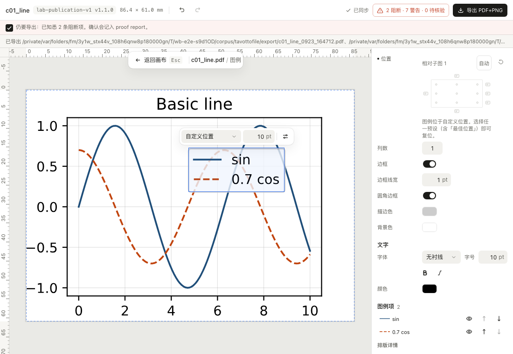
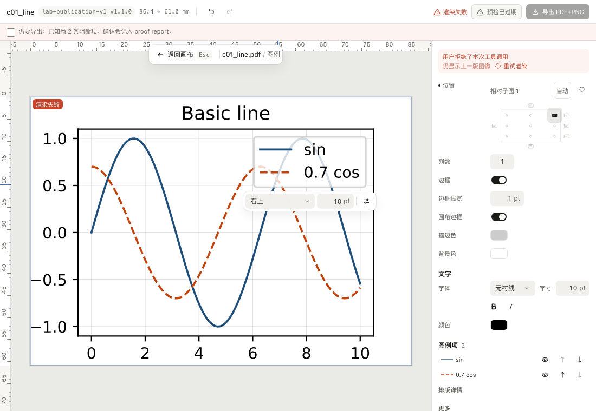
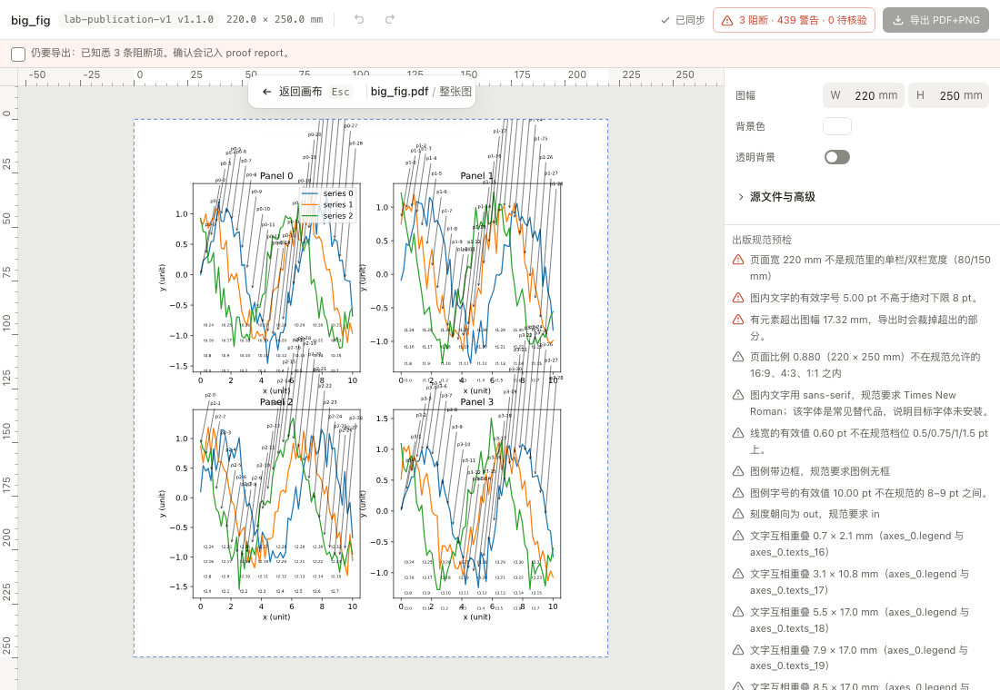
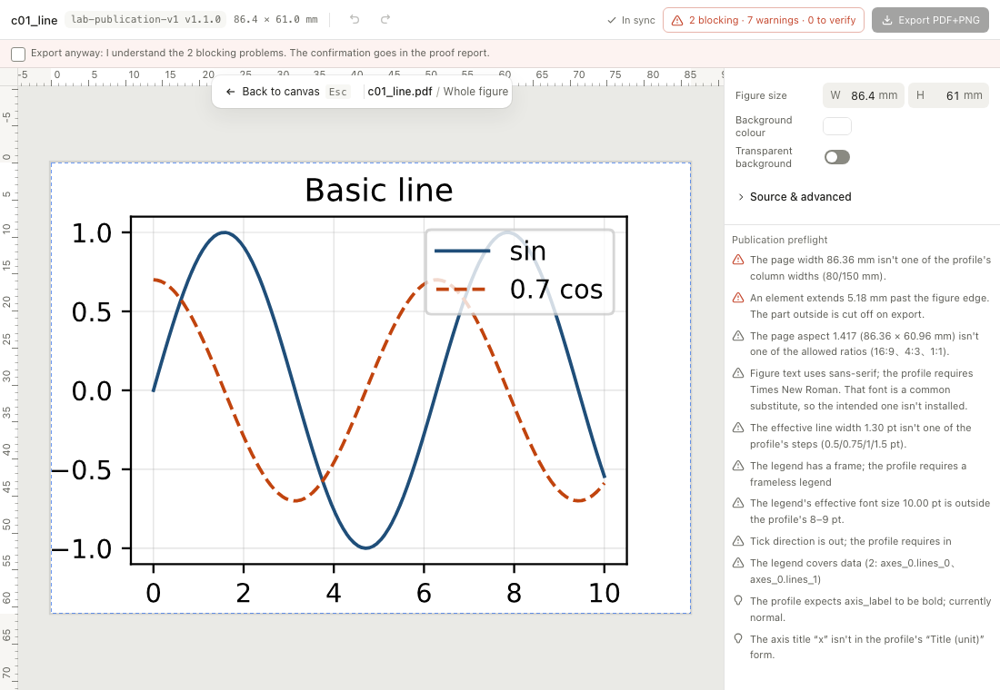

# WorkBuddy P0 兼容性 Spike：Tavotto MCP / MCP App 画布

这份文档回答一件事：**Tavotto 现有的 Codex MCP server + MCP App 画布，能不能以最小
改造接进腾讯 WorkBuddy。** 它是工程证据，不是上线结论。

证据分三层，**互相不能冒充**：

| 层 | 是什么 | 能证明 | 不能证明 |
| --- | --- | --- | --- |
| L1 协议探针 | `tests/workbuddy/probe.py`：冒充宿主的 stdio client 对**真** server（真启动器 → 真 resolver → 真引擎 → 真 matplotlib）发帧 | server 一侧的每条行为、每个失败分档 | 宿主实际发什么 |
| L2 WorkBuddy 形状假宿主 | `web/e2e/workbuddy-host.spec.ts`：照 WorkBuddy 公开文档 + L3 量到的真实回包写的假宿主 × **真画布产物** × **真 stdio server** | Tavotto 在「那种宿主」里的行为 | 真 WorkBuddy 是否真的这么做 |
| L3 真 WorkBuddy Desktop | WorkBuddy 5.6.2 + `tests/workbuddy/record_proxy.py` 旁听录制 + WorkBuddy 自己的日志 + WorkBuddy 随包源码 | 一切 | —— |

**最终判定取 L3。** L3 做不到的格子写 UNKNOWN，不拿 L1/L2 的绿替代。

## Environment

| 项 | 值 |
| --- | --- |
| OS | macOS 27.0（26A428） |
| architecture | arm64 |
| WorkBuddy version | **5.6.2**（`com.tencent.workbuddy.mac`；Electron 37.10.3；Agent CLI = 随包的 `codebuddy-lite-wb.mjs`） |
| Tavotto version | engine / plugin 0.16.0 |
| 待验树 | `origin/main` = `a9aa23a0`；spike 分支 `spike/workbuddy-p0`（产品代码只动了 `web/src/mcp/session.ts` 的一处判据，见 Blockers 下的「已修」） |
| 画布产物 | `codex-plugin/mcp/widget/canvas.html`，1,354,834 B（修复前 `7be2fa2094a9e6fa` / 修复后 `0b3aa58340f208f2`），`build_mcp_widget.py --check` 通过 |
| MCP server 解释器 | 仓库 `.venv`（Python 3.13.11，经 `TAVOTTO_MCP_PYTHON`） |
| 渲染 worker | Homebrew Python 3.13.11，matplotlib 3.10.8 |
| MCP protocol | **真 WorkBuddy 请求 `2025-11-25`**，server 回 `2025-11-25`（L1 用 `2025-06-18`） |
| MCP Apps protocol | 画布 `ui/initialize` 发 `2026-01-26` |
| 接入方式 | `~/.workbuddy/mcp.json`（WorkBuddy「用户 MCP」的配置文件）登记一条 stdio server，命令是录制代理；**未设** `TAVOTTO_MCP_ROOTS`、未设 `cwd` |
| 文档依据 | 腾讯云「MCP Apps 接入指南 - WorkBuddy Enterprise」（1831/137044，页面标注 2026-08-26）；`open.workbuddy.cn/docs/connector` |

L3 原始证据（已脱敏：主目录换成 `~`、会话元数据打码）在
[`workbuddy-l3-2026-09-23/`](./workbuddy-l3-2026-09-23/)：每个 Tavotto 进程一份录制
（`record-*.jsonl`），WorkBuddy 的 MCP Apps 诊断日志摘录（`mcp-apps-diag.excerpt.log`）与 Agent CLI
的 mcpUi / 进程退出摘录（`cli-mcpui.excerpt.log`）。

## Results

| Test | L1 / L2 | 真 WorkBuddy 5.6.2（L3） | 最终 | Evidence |
| --- | --- | --- | --- | --- |
| MCP initialize | PASS | **PASS** | PASS | L3：`protocolVersion 2025-11-25`，client `capabilities: {}`，握手 0.3 s |
| tools/list | PASS | **PASS** | PASS | 10 个工具齐；模型真实调 `tavotto_health`（157 ms，`ok: true`） |
| resources/read | PASS | **PASS** | PASS | 每次开图有 1–2 次读画布资源，其中至少一次走**一次性短连接**（新起 Tavotto 进程、cwd=`/`、读完即退），1,366,599 B / 10 ms |
| 1.35 MB Canvas | PASS | **PASS** | PASS | WorkBuddy 日志 `resolver.resolve.ok htmlLen=1288907 mimeType=text/html;profile=mcp-app`；`openHostApp.created` 起本地 `sandbox-proxy.html` |
| Canvas boot | PASS | **PASS** | PASS | 对话里出现画布，c01_line 正确显示（用户截图）；`awaitBootstrapToolResult hasResult=true` |
| reverse tools/call | PASS | **FAIL** | **FAIL（宿主缺陷，P0）** | 三次实测，画布发出的 `tavotto_apply_overrides` **一次都没到达持有会话的 Tavotto 进程**：① 出口审查拦截；② 两次都落到新的预热 CLI、排进看不见的审批队列、30 s 超时（见 Blockers P0-1/P0-2） |
| permissions | PASS（按文档建模） | **UNKNOWN** | UNKNOWN | 唯一一次走通授权的是 `bypassPermissions` 模式下的自动批准（没有框）；默认模式下审批被排进了新 CLI 的队列，UI 没有弹出，量不到「始终允许」 |
| workspace root | PARTIAL | **PASS** | PASS | 会话进程 `cwd = 用户选的工作目录`，另注入 `CODEBUDDY_PROJECT_DIR` / `CLAUDE_PROJECT_DIR`；`RootAuthority` 零改动取 `cwd` 为根。client 不声明 roots / elicitation |
| open figure | PASS | **PASS** | PASS | c01_line，23 元素，80 KB 结果，0.9 s（冷启动 worker） |
| drag edit | PASS | **FAIL** | FAIL | 同 reverse tools/call |
| preflight | PASS | UNKNOWN | UNKNOWN | 画布里的预检也是反向调用，同样到不了；模型发起的预检未测 |
| export | PASS | UNKNOWN | UNKNOWN | 同上 |
| large figure | PASS | UNKNOWN | UNKNOWN | 大图的取件本身就是反向调用（`tavotto_session_state`），按上面的结果必然失败；未单独测 |
| denial path | PASS | PARTIAL | PARTIAL | 源码：用户拒绝 → `{isError: true, "User denied UI tool call: …"}`（与文档一致）；**出口审查拒绝却不带 isError**（与文档不一致）。修复后的画布对两种都不再假成功（L2 用例 + 修复前画布负向对照） |
| engine missing | PASS | UNKNOWN | UNKNOWN | 未在真客户端上摘掉引擎 |
| canvas resource missing | PASS | UNKNOWN | UNKNOWN | 未测 |
| reconnect | UNKNOWN | **FAIL** | FAIL | WorkBuddy 在一轮结束后 SIGTERM 对话的 CLI（进而杀掉它启动的 Tavotto），下一次调用起全新进程；Tavotto 的进程内会话随之丢失（P0-2） |
| locale | PASS | UNKNOWN | UNKNOWN | 中文界面下画布是中文；英文界面未测 |
| theme | FAIL（P2） | UNKNOWN | FAIL（P2） | 画布从不读 `hostContext.theme` |






### 六个问题

| | 判定 | 一句话 |
| --- | --- | --- |
| Q1 启动 local stdio MCP | **PASS** | 真握手 + 10 个工具 + 模型真调用 |
| Q2 画布真实显示 | **PASS** | 1.35 MB 资源经 `resources/read` 进 iframe、画布进 ready |
| Q3 画布 → 宿主 → server 的反向 tools/call | **FAIL** | 宿主侧三个缺陷，任何一个都让调用到不了持有会话的进程 |
| Q4 权限体验 | **UNKNOWN** | 被 Q3 挡住，只在 bypass 模式下看到过「自动批准」 |
| Q5 可信工作区 | **PASS** | 会话进程 `cwd` = 用户选的工作目录，`RootAuthority` 零改动 |
| Q6 运行时 | A 开发机可用 / B 桌面版仍需 provision / C 全新机器**需要通用 `tavotto-mcp`** | 见 matrix 与 P1-1 |

## 真客户端里量到的 WorkBuddy 行为（附出处）

这些都有 L3 日志为证，源码位置只作解释（WorkBuddy 5.6.2 随包未压缩源码）：

1. **用户 MCP 只在启动 / 面板刷新时读**，`~/.workbuddy/mcp.json` 条目要先在面板批准（批准记录绑定配置哈希）——
   `workbuddy-server/src/agent-harness/mcp/item/providers/user-mcp-provider.ts`。
2. **stdio 的 `tools/list` / `resources/read` 走一次性短连接**（新进程，cwd=`/`，默认 15 s、上限 30 s），
   长连接进程由 Agent CLI 按会话启动——`…/controller/transport/stdio-transport.ts`。Tavotto 每次开图因此
   多一到两次冷启动（约 0.25 s），对无状态的资源读取无害。
3. **画布 HTML 按 app 缓存**：Tavotto 升级后不重启 WorkBuddy，开图卡片拿到的仍是旧画布（实测
   `htmlLen=1288907` 旧 / `1288972` 新）。
4. **反向 `tools/call` 的路线**：renderer → daemon `proxyAppToolCall` → `SessionMcpAppsRuntime`
   → 该对话的 Agent CLI 扩展方法 `_codebuddy.ai/mcpUiCallTool` → `requestMcpUiApproval`（完全访问 /
   跳过权限模式自动批准；会话批准表命中放行；否则排队弹框，拒绝回 `isError: true`）→ 调 MCP 工具。
5. **工具参数经本机 `sandbox-center` 做敏感信息检测**（模型发起的调用带 `session_id`，放行）。
6. **拒绝结果有两种形状**：用户拒绝 = `isError: true`；出口审查 / PreToolUse 钩子拒绝 = **不带 isError 的纯文字**。
   文档只写了前一种。

## Compatibility matrix

| 组件 | 判定 | 依据 |
| --- | --- | --- |
| Tavotto Engine | **Reusable unchanged** | L1/L2/L3 零改动 |
| MCP bridge（`tavotto_mcp/bridge.py`） | **Reusable unchanged** | 同上 |
| MCP server（`tavotto_mcp/server.py` + 启动器） | **Reusable with adapter** | 协议、体积预算、降级模式与宿主无关；写死「Codex」的用户可见文案要改（`roots.py` 10 行、`server.py` 13 行、`bridge.py` 23 行、启动器 19 行提到 Codex，部分是注释）；若要扛住 P0-2，会话需能跨进程恢复（见推荐方案） |
| roots（`RootAuthority`） | **Reusable unchanged** | L3：`cwd` 来源即可；可选地把 `CODEBUDDY_PROJECT_DIR` 加进 `WORKSPACE_ENVS` 作更明确的信号 |
| widget metadata（`widget.py`） | **Reusable unchanged** | WorkBuddy 读 `_meta.ui.resourceUri` / `csp` / `visibility`，OpenAI 别名被忽略 |
| appsBridge（`web/src/mcp/appsBridge.ts`） | **Reusable unchanged** | 在 WorkBuddy 的 `sandbox-proxy.html` 里握手、收 tool-result、发 tools/call 都正常 |
| Canvas（`web/src/canvas/*` + `web/src/mcp/*`） | **Reusable with adapter**（小） | 已修一处判据（见下）；缺 theme 跟随、启动屏写「Connecting to Codex…」 |
| Skill（`skills/tavotto-figure/`） | **Reusable with adapter** | 入口状态机与 `first-run-and-recovery.md`（117 行里 17 行是 Codex 安装 / 新开会话）要写 WorkBuddy 版 |
| runtime resolver（`codex-plugin/mcp/server.py`） | **Reusable with adapter** | A 可用（L3 就是这样跑的）；B 仍只能 `--provision`；C 当前架构不够（MCP server 与画布不在 wheel 里） |
| 版本 / 发布通道 | **WorkBuddy-specific** | 连接器包（`connector-meta.json` + `mcp.json` + `icon.svg` + `skills/`）与 Codex 插件清单不同 |

## Blockers

### P0

1. **WorkBuddy 出口审查拦下全部反向调用（宿主缺陷）。** CLI 的 `handleMcpUiCallTool` 调 MCP 工具时不带
   会话对象，`authorizeMcpEgress` 见会话为空直接回 `Sensitive MCP egress review is unavailable.`，且不带
   isError。L3：`proxyAppToolCall.ok … textLen=43`，4 ms，Tavotto 进程零调用；关掉「敏感信息保护」、
   同一对话重试仍然如此（CLI 进程未重启）。
2. **WorkBuddy 一轮结束后回收对话的 CLI，反向调用落到新的预热进程（宿主行为）。** L3 重启 WorkBuddy 后
   两次新对话都复现：开图那一轮 `end_turn` 后 3–5 s，对话 CLI 收到 SIGTERM，它启动的 Tavotto（持有编辑会话）
   一起退出；画布随后的 apply 被投递到预热池激活的新 CLI（`--prewarm` → `--serve --session-id=<同一对话>`），
   它 `memSessionId=none`、权限模式回落 `default`，把调用 `enqueueSandboxApproval` 排队但界面没有弹框，
   daemon 30 s 超时（`mcpUiCallTool ms=30003`）。即便批准，它连的也是**新起的** Tavotto，里面没有那个
   `session_id`。重启前的第一个对话里 CLI 跨轮存活 10 分钟以上，所以「回收」不是每次都发生，触发条件未知。
3. **P0-1 与 P0-2 修好之前，Q4（权限体验）无法验收。**

### P1

1. **全新机器装不上（Q6-C）。** MCP server 只随 Codex 插件分发；WorkBuddy 托管 Python 运行时能装 PyPI 包，
   但 PyPI 上的 `tavotto` 不含 MCP server 与画布。
2. **Tavotto 的编辑会话只活在 server 进程内存里。** 在 Codex 里一直成立（一个任务一个长连接进程），在
   WorkBuddy 里被 P0-2 打破。即使 WorkBuddy 修好路由，进程回收仍会让会话丢失——需要「按 `session_id`
   在新进程里恢复」的能力（见推荐方案）。
3. **反向调用 UI 型工具会再开一张画布卡片。** L3：画布自己调 `tavotto_apply_overrides` 后，WorkBuddy
   `openHostApp` 又为这次调用建了一个新实例（`toolCallId=(none)`）。反向调用通了之后，每次拖动可能多出
   一张卡片，待验。
4. **大图显示前就要一次反向调用（取件）**，在 WorkBuddy 的授权模型下意味着先弹框才能看图。
5. **写死「Codex」的用户可见文案**（启动屏、授权失败的下一步、降级 server / health）。
6. **WorkBuddy 缓存画布 HTML**：Tavotto 升级后要重启 WorkBuddy 才换画布。

### P2

1. 画布不读 `hostContext.theme`，前端没有暗色主题。
2. 会话中途 `host-context-changed` 改 locale 只切一半（L2）。
3. resolver 只验 `import tavotto.engine`，不验必需依赖 PyMuPDF；MCP 的 `artifact_rejected` 错误丢了 `error_params.failed`。
4. 资源描述不带 `size`。

### 已修（本 spike 内）

**画布把宿主的纯文字拦截当成成功，用空结果抹掉图（L3 首次实测撞到）。** `web/src/mcp/session.ts` 的
`unwrap()` 改成正面判据 `ok === true`：没有结构化内容的结果带 `host_unstructured_result`、宿主原话原样
显示、上一版图像保留。看护：`session.test.ts` 两条（变异回旧判据双双变红）、`workbuddy-host.spec.ts`
「出口审查」一条（修复前画布跑红、修复后绿）。前端全量 4215 条通过；MCP pytest 214 条通过；
`mcp-canvas` e2e 6/6 通过。

### 本次踩到并已排除的假红（方法论）

L1 第一轮量到「PDF 导出一律 `artifact_rejected`」——是探针给 server 设了 `PYTHONPATH`，让启动器自己
的 Homebrew Python（缺 PyMuPDF）被 resolver 选成引擎。去掉后全绿；探针与 L2 都已写死不带 PYTHONPATH。

## Recommended architecture

原方案：

```text
Tavotto Buddy App
        ↓
Tavotto Connector
        ↓
generic Tavotto MCP Runtime
        ↓
Tavotto Engine + Canvas
```

证据对各层的结论：

* **Engine + Canvas：「One Canvas, Multiple Hosts」成立。** 同一份 `canvas.html` 在 Codex（真机）、
  WorkBuddy 形状宿主（L2）、真 WorkBuddy（L3，显示与启动）里都没有 fork；唯一的产品改动是一处与宿主
  无关的正确性判据。
* **Connector：工作区授权不再是问题**（Q5 PASS）。连接器的真正风险转到**宿主怎么托管 stdio 进程**：
  短连接探测、按会话起进程、一轮后回收。
* **generic Tavotto MCP Runtime：支持，且新增一条硬要求——会话可恢复。** 画布发的本来就是**全量**
  patches（override 语义），所以「在新进程里按 `session_id` 重建会话」只需要把会话描述（项目、stem、
  规范、已提交的 patches 与合同）落在 `engine/config.data_dir()` 下，新进程收到未知会话时先过
  `RootAuthority` 再重开渲染。这把 Tavotto 从「依赖一个长连接进程」改成「进程可替换」，对 Codex
  同样有益（Codex 改配置也会重启 server，见 codex-desktop-canvas.md 末节）。它是架构改动，需要 ADR，
  不在本 spike 内做。
* **Buddy App：没有证据**，按任务书也不该验证。

**但无论 Tavotto 怎么改，P0-1（出口审查拦截）只有 WorkBuddy 能修；** P0-2 的路由（反向调用落到新的
预热进程、审批框不显示）也只有 WorkBuddy 能修，Tavotto 的会话恢复只能缓解它的一半（进程换了），
补不上另一半（调用卡在看不见的审批队列）。

## 需要向 WorkBuddy 官方报告 / 确认的问题

这些现在是**带证据的缺陷报告**，不再是泛泛的问题：

1. **`handleMcpUiCallTool` 调 MCP 工具时没有传会话**，出口审查因此对所有 MCP App 反向调用回
   `Sensitive MCP egress review is unavailable.`；而且这个拒绝不带 `isError`，与文档「拒绝时 widget 拿到
   `{isError: true}`」不一致。（附 `mcp-apps-diag.excerpt.log` 09:28:06 / 09:37:22 两段。）
2. **一轮结束后对话 CLI 被 SIGTERM，之后的 `mcpUiCallTool` 被投递到预热池的新 CLI**，新 CLI 不知道对话的
   权限模式、把审批排进一个界面上不显示的队列，30 s 后超时；它还会为本地 stdio server 新起一个进程，
   有状态的 server 因此丢失会话。回收的触发条件是什么？有没有「MCP App 活着时保持会话 CLI」的机制？
   （附 `cli-mcpui.excerpt.log` 17:47–17:50 段。）
3. 画布自己调带 `_meta.ui` 的工具时为什么再开一个 app 实例？`_meta.ui.visibility` 设 `["app"]` 或别的
   声明能否避免？
4. 反向调用的「始终允许」能否由连接器为只读工具预先声明？
5. 画布 HTML 的缓存何时失效？连接器升级时能否主动失效？
6. token 模式（`token-schema.json`）字段能否以环境变量注入 **stdio** 连接器？
7. v5.0.0 托管 Python 运行时的版本、pip 包与版本的指定方式、隔离环境位置与升级处理？

## L3 复现步骤

1. `python scripts/build_mcp_widget.py --check`；记录 WorkBuddy 版本（关于页）与 `git rev-parse HEAD`。
2. 在 `~/.workbuddy/mcp.json` 写（**不设** `TAVOTTO_MCP_ROOTS`、不设 `cwd`）：

   ```json
   {
     "mcpServers": {
       "tavotto": {
         "type": "stdio",
         "command": "python3",
         "args": ["<本树>/tests/workbuddy/record_proxy.py"],
         "env": { "TAVOTTO_MCP_PYTHON": "<装了 tavotto 0.16.0 的解释器>" }
       }
     }
   }
   ```

   **完全退出 WorkBuddy 再打开**（它只在启动时读这个文件），到设置的 MCP 管理处批准 `tavotto`。
3. 新建对话，工作目录选一份 corpus 副本所在目录；让模型调 `tavotto_health`，再
   `tavotto_open_figure(project_path=<副本>/corpus, stem=c01_line)`。
4. 画布出现后拖图例；判据全在 `~/tavotto-workbuddy-record/record-*.jsonl`（每个 Tavotto 进程一份）、
   `~/.workbuddy/logs/mcp-apps-diag.log`（`proxyAppToolCall.*`）与 `~/.workbuddy/logs/**` 里 Agent CLI 的
   `DIAG-mcpui` / `enqueueSandboxApproval` / `[ProcessExit]` 行。
5. **通过的判据**：拖动后，**持有 `session_id` 的那个 Tavotto 进程**的录制里出现
   `tools/call tavotto_apply_overrides` 且返回 `ok: true`，画布回到「已同步」且图例位置改变。
6. 测完把「敏感信息保护」恢复为开启。
